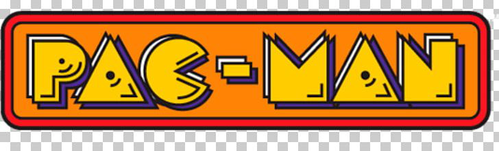

última atualização 14/07/2022
# Objetivo
Criar um jogo estilo pacman utilizando linguagem C++ e POO.
# Como rodar o jogo?
## Ubuntu 15.0 a 21.0
Caso ainda não tenha instalado baixe a biblioteca do SFML com o seguinte comando:
```
sudo apt-get install libsfml-dev
```
Em seguida basta rodar de dentro do diretório de trabalho:
```
make
```
# Arquivos
```
.
├── build
│   ├── collision.o
│   ├── coordenada.o
│   ├── food.o
│   ├── game.o
│   ├── ghosts.o
│   ├── main.o
│   ├── map.o
│   ├── menu.o
│   ├── object.o
│   ├── pacman.o
│   └── personagem.o
├── data
│   ├── background.png
│   ├── ethn.otf
│   ├── ghost_blue.png
│   ├── ghost_green.png
│   ├── ghost_red.png
│   ├── ghost_yellow.png
│   ├── mapa.txt
│   ├── PixellettersFull.ttf
│   ├── sounds
│   └── sprites
├── image.png
├── include
│   ├── collision.hpp
│   ├── coordenada.hpp
│   ├── food.hpp
│   ├── game.hpp
│   ├── ghosts.hpp
│   ├── globals.hpp
│   ├── map.hpp
│   ├── menu.hpp
│   ├── object.hpp
│   ├── pacman.hpp
│   └── personagem.hpp
├── main
├── main.cpp
├── makefile
├── README.md
├── src
│   ├── collision.cpp
│   ├── coordenada.cpp
│   ├── food.cpp
│   ├── game.cpp
│   ├── ghosts.cpp
│   ├── map.cpp
│   ├── menu.cpp
│   ├── object.cpp
│   ├── pacman.cpp
│   └── personagem.cpp
└── test
    ├── collision_test.cpp
    ├── doctest.h
    └── main_test.cpp

7 directories, 48 files
```
## modelagem
Contém o User Stories, CRC cards e apresentação.
## include
Contém os métodos e classes utilizados para a criação do jogo.
## src
Contém o código fonte do jogo e implementação.
## tests
Contém os testes utlizados para depuração dos métodos.
## makefile 
Contém os comandos utilizados no terminal para depuração e execução do jogo.
